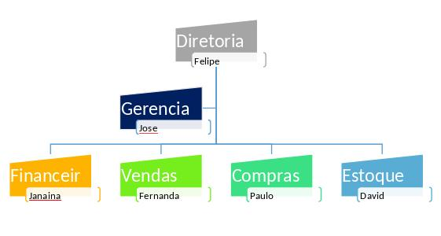

# Introdução do trabalho

Hoje em dia a integração do negócio com sistemas informatizados é uma necessidade para que a empresa se torne competitiva e o não uso dessas tecnologias podem deixa-la em desvantagem com o mercado, este documento tem como objetivo justificar e documentar a criação de um sistema informatizado de controle e gerenciamento de uma Pet Shop.

# Justificativa do trabalho

## Situação atual da empresa

Com a evolução da TI ao longo dos anos, a utilização de sistema informatizados pelas empresas deixou de ser somente um diferencial e passou a ser uma necessidade, a empresa que não possuí esses sistemas trabalha com processos manuais lentos, podendo causar demora nos atendimentos aos clientes e insatisfações que podem levar a perda de clientes para a concorrência mais preparada.

## Motivos para o desenvolvimento do trabalho

Com a finalidade de melhorar e agilizar processos antes realizados manualmente, como controle de vendas, marcações e controle de atendimentos e análise de relatórios gerenciais, será desenvolvido o sistema EasyPet de controle de Pet Shop.

# Objetivos do trabalho

### O que se espera do software depois da implementação na empresa

Com a implantação da ferramenta, se espera que a realização de vendas, controle de estoque, marcação e controle de atendimentos e retirada de relatórios gerenciais sejam feitos de forma rápida, fornecendo informações mais precisas.

# Objetivo geral

Desenvolver um sistema de gestão e controle de processos para Pet Shop.

# Objetivos do sistema
## Benefícios que o sistema irá proporcionar

Com o auxílio do sistema, espera-se que a gerência obtenha dados melhores, mais detalhados e de forma mais rápida, também se espera que as funções de vendas, agendamentos sejam executadas com mais eficiência e não haja erros com horários.

# Objetivos específicos

* Levantar requisitos do sistema
* Documentar utilizando UML

# Termo de abertura do projeto de software
##  Resumo das condições do projeto

Baseado em análises realizadas com o cliente, ficou clara a necessidade de criação de uma solução para gestão de processos de vendas, marcações de atendimentos e retirada de relatórios gerenciais.

## Justificativa do projeto

O cliente Happy Dog concordou com a necessidade de criação do sistema para gestão de seu negócio visando melhoria na eficiência dos processos que atualmente são realizados manualmente com auxílio de Excel.

## Nome do gerente do projeto, suas responsabilidades e sua autoridade

Paulo Barcelos é o gerente do projeto e tem como atribuições, delegar tarefas aos membros da equipe, marcação de reuniões, caso necessário, e controlar as etapas do projeto afim de atender o que o cliente espera com a implantação do sistema.

## Necessidades básicas do trabalho a ser realizado

A equipe será composta de 3 pessoas, Fabiana Araujo, Marcos Paulo e Jonatan Silva, terá reuniões nas segundas-feiras, acesso à internet para uso das ferramentas Skype, Whatsapp e ferramentas CASE: Bizagi, XMind, BrModelo, Umbrello e OpenProj. O gerente será responsável pelo controle do andamento das etapas do projeto e todos documentos a elas relacionadas.

## Principais partes interessadas

* Pet Shop Happy Dog
* Membros da equipe

## Descrição do projeto
### Produto do projeto

Sistema informatizado e documentado de controle de processos de Pet Shop

### Cronograma básico do projeto

Os trabalhos tiveram início em 22 de Novembro de 2017 e seu prazo limite será em 06 de Dezembro de 2017.

### Premissas iniciais

* A comunicação do time será feita via e-mail, Skype, Whatsapp, reuniões serão presenciais ou virtuais.
* A equipe deverá ter conhecimento sobre as Regras de negócio da gestão de uma Pet Shop.
* Cada membro será responsável pelo desenvolvimento de uma etapa do projeto e revisar as entregas.

### Restrições iniciais

* Prazo limite de 06 de Dezembro de 2017.

### Organograma atual da empresa e informações sobre as atividades por departamento

**Diretoria**: responsável pela organização de todos departamentos
**Gerencia**: responsável pelos departamentos
**Vendas**: responsável pelas vendas, marcações de atendimento e cadastro de clientes
**Compras**: responsável pelas compras
**Administrativo**: responsável pelo controle de produtos, registro de entrada e saída de produtos, responsável por cadastro de fornecedores
**Financeiro**: responsável pelas contas a pagar e a receber da empresa

# Estratégias de Marketing e público-alvo
Após o lançamento do sistema será oferecido desconto aos primeiros 50 clientes cadastrados, o público alvo do sistema são todos clientes da Pet Shop, os funcionários, que executarão mais rápido suas tarefas com menor número de erros e os gerentes que terão melhores dados para tomada de decisão.

# Políticas de Privacidade e de Segurança
No sistema, só terão acesso a informações importantes, as pessoas com prévia autorização e os todos usuários do sistema precisarão estar autenticados para realizar qualquer tarefa.

# Pontos fortes / vulneráveis / fracos (SWOT / FOFA)
## Pontos Fortes:

* Muitos anos de experiência
* Conhecimento do negócio

## Pontos Fracos:

* Falta de planejamento a longo prazo
* Ausência de sistema de controle de informações
* Dificuldade no controle de marcações de banho, tosa, adestramento e passeio

## Oportunidades:

* Abertura de mais lojas na cidade
* Melhoria nos processos através de sistema informatizado

## Ameaças:

* Concorrência com experiência
* Concorrência com processos informatizados que deixam o atendimento mais eficiente

